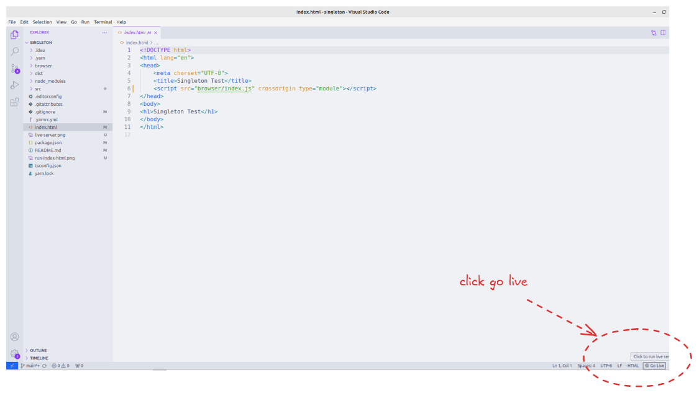

# Singleton

## Installation
`yarn`

## Node.js
1. Build: `yarn build`
2. Start: `yarn start`

## Browser
1. Build: `yarn build-browser`
2. Install live-server in VSCode
   
3. Open the index.html file
3. Run the `index.html` file with live-server
   
4. See browser console
